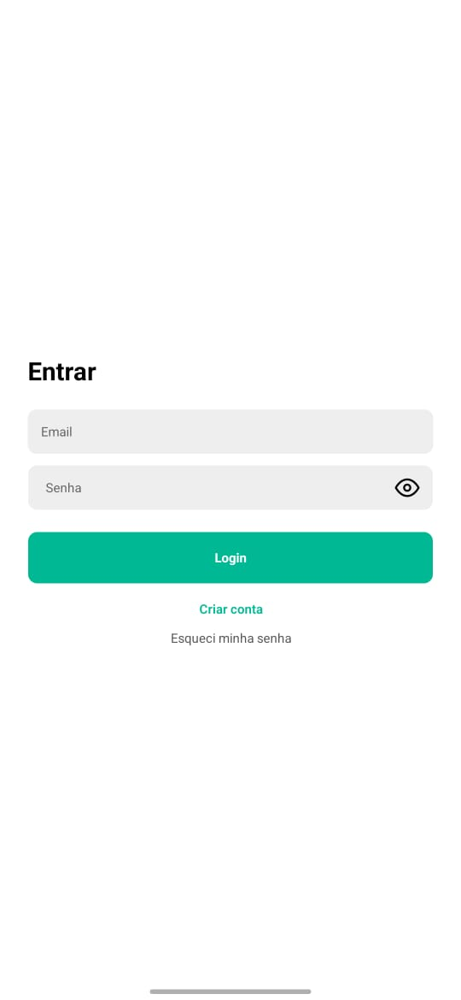
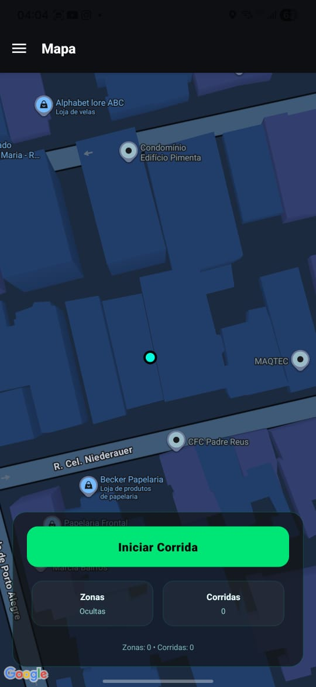
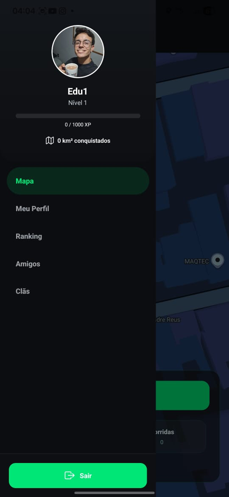
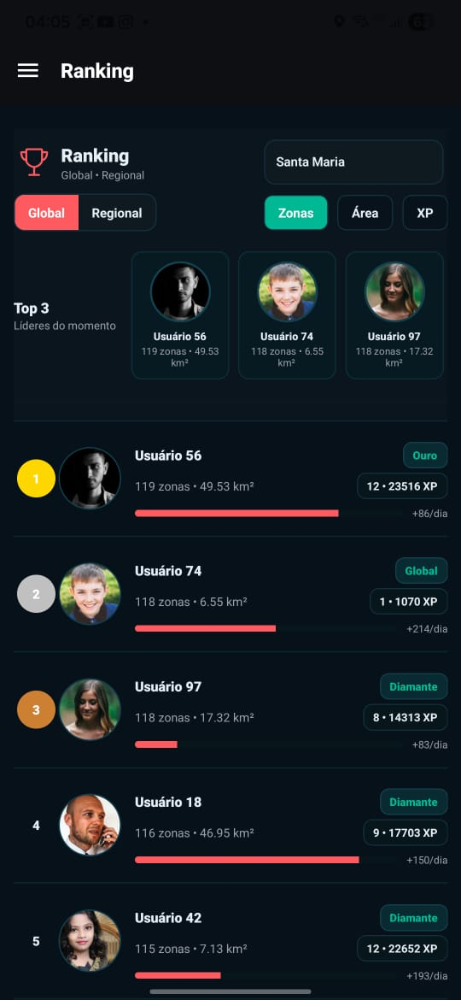
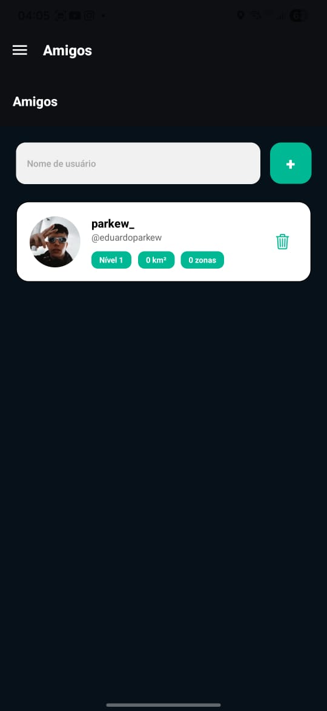

# 🏃‍♂️ Wayper – Corra, Conquiste e Domine Territórios Reais

### Transforme suas corridas em uma experiência estratégica e competitiva.

O **Wayper** é um app de corrida gamificado que leva sua experiência além do cronômetro. Enquanto você corre, o Wayper registra sua rota, identifica sua área de atuação e transforma seu trajeto em **zonas conquistadas dentro do mapa real da sua cidade**.

Cada corrida se torna uma oportunidade de expandir seu território, disputar espaço com outros corredores e evoluir no ranking geral.

A missão é simples: **correr, competir e se divertir dominando o maior território possível.**

---

## 🎯 Objetivo Principal
Tornar a corrida uma experiência mais envolvente por meio de **estratégia**, **competição saudável**, **exploração urbana** e **conquista de áreas reais**, incentivando os usuários a correr mais e explorar novos lugares.

---

## 👥 Público-Alvo
- Corredores de todos os níveis que buscam motivação  
- Pessoas que adoram competições e desafios  
- Atletas casuais atrás de metas mais divertidas  
- Exploradores urbanos em busca de novos trajetos  
- Usuários que gostam de apps interativos e gamificados  

---

## 🧩 Principais Funcionalidades

### 📍 Conquista de Zonas
- Rastreamento via GPS durante a corrida  
- Cada trajeto percorrido gera uma nova zona no mapa  
- Expansão contínua de território conforme você explora novos caminhos  

### 🏆 Ranking Competitivo
1. Ranking interno com:
   - Maior número de zonas conquistadas  
   - Maior área total dominada (em m²)  
2. Atualização em tempo real conforme os usuários correm

### 📊 Estatísticas Detalhadas
- Distância, tempo, velocidade e ritmo  
- Histórico de corridas e evolução de território  
- Comparativos pessoais e progresso ao longo do tempo  

### 🌍 Mapa Interativo
- Visualização clara das suas zonas  
- Exibição de áreas de outros usuários  
- Possibilidade de explorar novas regiões para expansão  

### 🎮 Gamificação Inteligente
- Metas de corrida e objetivos personalizados  
- Sistema de conquistas baseado em desempenho e exploração  
- Competição saudável incentivando treino e diversão  

---

## 🛠️ Tecnologias Utilizadas

**Frontend:** React Native  
**Backend:** Node.js / Firebase  
**Banco de Dados:** Firestore  
**Mapas & Localização:** Google Maps API  
**Autenticação:** Firebase Auth  

---

## 🚧 Status do Projeto
**Em desenvolvimento**  
Novas funcionalidades, melhorias de experiência e expansão do sistema de zonas estão em andamento.

---

## 📸 Galeria do App

<p align="center">
   
   
   
   
   
   
   
</p>

---

## 🧪 Instalação e Execução (dev)
```bash
# Clone o repositório
git clone https://github.com/Eduardo220/wayper.git

# Acesse a pasta
cd wayper

# Instale as dependências
npm install

# Inicie o app
npm start
