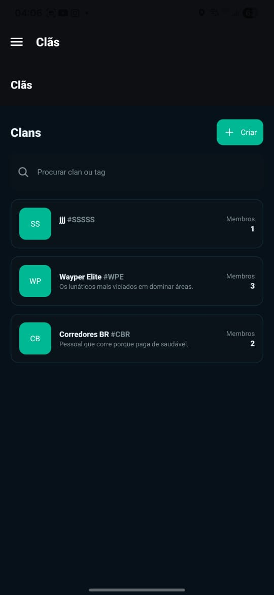

# Wayper — exercício real, aventura contínua

> A Wayper transforma exercício físico em uma aventura contínua. Durante a
> atividade, o usuário apenas corre. Depois da atividade, descobre tudo o que
> conquistou.

**A corrida é a ação. O pós-corrida é o jogo.**

A Wayper é uma plataforma mobile de exercício físico gamificada. Ela registra a
atividade com prioridade em segurança, background, recuperação e funcionamento
offline. Depois do salvamento, transforma os dados em descoberta: desempenho,
trajeto, territórios, progressão, competição, replay e recompensas futuras.

Durante a atividade, a experiência deve ser mínima e não exigir atenção ao mapa.
Territórios são consequência do movimento real, não uma obrigação visual.

## Pilares

- tracking confiável, local-first e recuperável;
- atividade segura com tela apagada e em background;
- Relatório da Expedição como experiência pós-corrida principal;
- território, progressão, competição e exploração urbana;
- experiência gratuita respeitosa e assinatura baseada em valor;
- ecossistema futuro de desafios, comunidades e parceiros sem interromper o
  corredor.

## Estado do produto

Em `develop`, tracking canônico, checkpoints, recuperação, salvamento local,
sincronização posterior, territórios, XP, ranking, replay e compartilhamento
existem em níveis diferentes de maturidade. O Relatório da Expedição, planos,
entitlements, parceiros, anúncios e pagamentos ainda não estão implementados como
domínios completos.

A prioridade atual é concluir a fundação confiável da corrida antes de antecipar
gamificação ou monetização futura.

## Contexto canônico

- [AGENTS.md](AGENTS.md): regras obrigatórias para agentes;
- [fontes do projeto](docs/00-fontes-do-projeto.md): hierarquia e matriz de
  leitura;
- [direção estratégica completa](docs/product/direcao-estrategica-completa.md):
  fonte normativa de direção e restrições;
- [índice de produto](docs/product/README.md): recortes temáticos;
- [auditoria de 2026-07-24](docs/audits/2026-07-24-direcao-oficial-produto.md):
  evidência histórica de aderência, não inventário permanente.

## 🛠️ Tecnologias Utilizadas

**Frontend:** React Native  
**Backend remoto atual:** Firebase

**Persistência:** local-first com sincronização posterior para Firestore
**Mapas & Localização:** MapLibre + OpenFreeMap  
**Autenticação:** Firebase Auth  

## Monitoramento com Sentry

O Sentry e opcional em development e ativo em staging/production quando `EXPO_PUBLIC_SENTRY_DSN` esta configurado. Use as chaves documentadas em `.env.example` no ambiente local/EAS apropriado.

```bash
npm run sentry:check
npm test
npm run eas:preview
```

O token de upload de source maps deve ser armazenado como `SENTRY_AUTH_TOKEN` em secret de CI/EAS. O Sentry nao substitui os diagnosticos NDJSON/ZIP e nao recebe coordenadas ou rotas cruas.

---

## 🚧 Status do Projeto
**Em desenvolvimento**  
Novas funcionalidades, melhorias de experiência e expansão do sistema de zonas estão em andamento.

---

## 📸 Galeria do App

<p align="center">
   
   
   
   
   
   
   
</p>

---

## 🧪 Instalação e Execução (dev)
```bash
# Clone o repositório
git clone https://github.com/Eduardo220/wayper.git

# Acesse a pasta
cd wayper

# Instale as dependências
npm install

# Inicie o app
npm start
```
