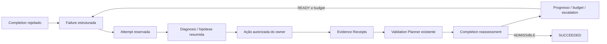

# Bounded Feedback Loop V1

Fase 5 do Harness V2. Feedback trabalha; a [Completion Boundary](completion-boundary.md)
decide admissibilidade. `SUCCEEDED` exige um CompletionAssessment `ADMISSIBLE`;
não significa host Goal DONE. Implementação: `scripts/wayper-feedback.mjs`.

## Fronteiras investigadas

| Fronteira | Estado anterior à Fase 5 / contrato atual |
| --- | --- |
| CURRENT_FAILURE_FLOW | Completion retornava blockers; principal interpretava, corrigia, retestava e solicitava outro assessment. Não havia sessão/tentativa persistida. |
| CURRENT_RETRY_POLICY | Orchestration e Meta Goal permitiam no máximo um retry racional para falha transitória; stall exigia investigação/replan. A política continua, sem retry universal. |
| CURRENT_EXECUTION_BOUNDARY | Owner usa host shell/edit/spawn. Stop consulta Completion quando vinculado e protege reentrância; não executa correções. Não há interceptação universal. |
| CURRENT_BLOCKER_TYPES | STATE, REQUIREMENT, VALIDATION, EVIDENCE, FINDING, PROOF_GAP, AMBIGUITY, com IDs, reasonCode, repo e relações. Warnings não viram failures. |
| CURRENT_TELEMETRY | Completion guarda assessment e tentativas de conclusão. Evidence guarda execução observada, resultado/provenance e metadata attemptId/failureId. |
| TARGET_FEEDBACK_STATE | Sessão Goal/revision/baseline-bound, journal exclusivo, orçamento conservador, histórico de tentativas, falhas atuais e outcome. |
| TARGET_ATTEMPT_LIFECYCLE | Selecionar falha → diagnosis bounded → preconditions → reservar → ação → Evidence/Validation → Completion → comparar progresso → parar/continuar/escalar. |



## Contratos e identidade

`FeedbackSession` e `FeedbackAttempt`, schemaVersion 1, são fechados em
`wayper-feedback-schema.mjs`. Campos desconhecidos são rejeitados.

- Session: feedbackId, goalReference, baselineReference, initial/current/finalAssessmentId,
  targetBlockerIds, state, attemptBudget, índices de attempts, activeAttempt,
  currentFailureSet, failureSetFingerprint, currentStateFingerprint, progressState,
  outcome, reasonCode, decisionRequest, sequence/previousFingerprint/fingerprint.
- Attempt: attemptId/number, feedbackId/failureId/class/repository, Goal/baseline,
  diagnosis/hypothesis resumidas, action e fingerprints, seleção/dependências,
  stateBefore/After, changedFiles, validationBefore/After, completionBefore/After,
  executionRefs, receiptIds, progress/outcome, bytes/tokenProxy do contexto.
- `FB-<sha256>` deriva de Goal/revision/baseline/assessment inicial. Repetir start
  sobre o mesmo assessment recupera a sessão, sem resetar o budget.
- `FL-<sha256>` deriva de kind/sourceId/reasonCode/repo/requirements/findings.
  Mensagens, stack traces e receipt IDs voláteis não redefinem a causa. Receipts
  permanecem como relações auditáveis; evidência é normalizada para seu critério.
- `AT-<sha256>` deriva de feedbackId + número da tentativa.
- Fingerprints não incluem timestamp. Tempo observado fica no envelope do journal.

Diagnóstico relaciona exatamente a falha selecionada, causeClass, summary,
hypothesis, confidence, affectedScope, proposedActionKind, validationRequirementIds
e evidenceRefs. Textos limitados a 240 bytes; paths/refs limitados a 16. Não existe
campo para chain-of-thought, transcript ou logs completos. O owner fornece resumo
operacional, sem raciocínio privado. O schema não classifica semanticamente prosa.

## Classes, seleção e budget

| Classe | Ações permitidas / tratamento | Prioridade |
| --- | --- | --- |
| INVALID_STATE | Encerrar com segurança, sem retry | 0 |
| REPLAN | REPLAN pelo writer existente de Validation Plan | 1 |
| EXTERNAL | BLOCKED_EXTERNAL, zero tentativas automáticas | 2 |
| HUMAN_DECISION | HUMAN_REQUIRED + decisionRequest, sem inventar decisão | 2 |
| FIXABLE | EDIT, REVIEW, INSPECT ou REVALIDATE; callback autorizado | 3 critical, 4 high, 6 demais |
| REVALIDATE | REVALIDATE ou INSPECT; EDIT rejeitado | 5 |

Empates usam failureId. Dependências conhecidas de Validation requirements têm
precedência no mesmo repo; dependências desconhecidas são `UNKNOWN`, sem grafo
inventado. Nenhuma falha elegível resulta INVALID_STATE. Novas falhas ficam na
mesma sessão enquanto identidade/baseline são compatíveis e há budget global.

Máximo global: 3 tentativas; ARCHITECTURAL/CRITICAL_RUNTIME e riscos críticos
listados na policy: 2. Owner pode reduzir, nunca aumentar. Por falha comparável:
REVALIDATE/REPLAN até 2, FIXABLE até o teto global; classes externas/humanas/invalid
têm zero. Quantidade de ferramentas não define tentativa. Nenhum retry de
comando falho ocorre dentro de uma tentativa.

## Progresso e encerramento

| Relação | Significado |
| --- | --- |
| SAME | Mesmo conjunto de IDs |
| REDUCED | Removeu falhas sem introduzir novas |
| CHANGED | Substituiu falhas; não é sucesso |
| RESOLVED | Nenhuma falha; sucesso ainda depende de ADMISSIBLE |
| EXPANDED | Adicionou falhas sem remover anteriores |

Progresso exige redução material ou criteria/validation requirements recém
satisfeitos. Aumento do conjunto ou novo finding crítico é REGRESSION. Mais
arquivos, execuções, receipts ou palavras não são progresso. Sem progresso:
`REASSESS_CAUSE`; a próxima tentativa exige outra hipótese. Mesma causa/hipótese/
ação/estado anterior gera `DUPLICATE_ACTION`; hipótese repetida em outro estado
gera `NEW_HYPOTHESIS_REQUIRED`. Duas tentativas sem progresso encerram NO_PROGRESS.
O runtime não consegue provar que duas hipóteses semanticamente parafraseadas
são diferentes; o budget global continua limitando o custo.

Estados: READY → ACTING → ACTION_COMPLETE → VALIDATING → READY ou REASSESS_CAUSE;
terminais FINISHED/STALE. Outcomes: SUCCEEDED (ADMISSIBLE), EXHAUSTED (budget),
NO_PROGRESS, BLOCKED_EXTERNAL, HUMAN_REQUIRED, REPLAN_REQUIRED (stale/concorrência/
inputs do owner necessários), INVALID_STATE e CANCELLED. Erro de execução fica
na tentativa como ACTION_FAILED; receipt FAIL continua sendo FAIL.

## API, adapters e persistência

APIs: `startFeedbackSession`, `runFeedbackIteration`, `runFeedbackLoop`,
`resumeFeedbackSession`, `recoverFeedbackSession`, `cancelFeedbackSession`.
`runFeedbackLoop` continua somente READY; REASSESS_CAUSE retorna ao owner.

```js
const session = startFeedbackSession({ root, identity });
await runFeedbackIteration({ root, identity, feedbackId: session.feedbackId,
  diagnose: async (boundedFacts) => diagnosisSummary,
  act: async (ctx) => { /* ctx.edit / observadores / owner record */ },
  validate: async (ctx) => { /* prova adicional exigida pelo critério */ },
});
```

CLI: `node scripts/wayper-feedback.mjs start|inspect|resume|step|run|cancel`
com `--thread-id`, `--goal-run-id`, `--revision`, `--feedback-id` quando aplicável,
`--diagnosis '<JSON>'` em step/run e `--attempt-budget` opcional no start.
EDIT/REVIEW/INSPECT exigem callback; CLI não gera patches/model calls.

O executor fornece guard, edit, observeCommand/Test/QualityGate/Source, record,
prove, replan, validate. Edit é limitado ao repo/paths declarados e fase ACTING;
rejeita traversal/symlinks/áreas internas. Observadores existentes registram
metadata taskId=feedbackId, attemptId e failureId controladas pelo runtime.
Commands de validação vêm dos candidateChecks do Planner; sem candidato disponível,
Completion mantém o blocker. Provas de criteria adicionais são fornecidas pelo
owner e passam por `proveWorkingContext`. Nenhum booleano do callback vira prova.

Journal ignored por Git:
`.wayper-context/feedback/<goalRunId>/r<revision>/<FB-id>/<sequence>.json` e
`AT-<hash>.json`. Publicação atômica com fsync/link exclusivo, tentativas imutáveis,
checkpoints encadeados e schema/identidade/assessment validados. Máximo 32 checkpoints
por sessão; não é banco nem lease global. Um callback mutável por sessão.

Resume é read-only: CURRENT, STALE ou INTERRUPTED, com refs de receipts produzidos.
Revision, baseline, blocker/owner state ou checkout alterado impedem continuar.
Amendment remove somente o índice ativo da nova revisão, preservando o histórico.
Recovery exige `ownerStopped: true`: confirmação operacional do owner, não detecção
de liveness do host. ACTION_COMPLETE/VALIDATING com snapshot idêntico retoma apenas
validação e reassessment. ACTING incerto ou estado alterado exige replan; nunca
reexecuta a ação. Uma tentativa já finalizada não é repetida.

## Integrações, cobertura e observabilidade

Working Context/Context Map guardam índice de até 8 falhas, último attempt,
até 8 receipt refs e 2 hipóteses falhas, com omitted count. Inspect mostra freshness;
resume consulta o journal atual. Packet filtra por repo e rejeita omissão/leakage.
Handoff pode devolver feedbackId/failureId/attemptId + diagnosisSummary como
HANDOFF_ASSERTED, sem autoridade para avançar tentativa. Owner continua responsável
pelo merge. Router não muda e nenhum agent novo é criado.

Feedback não altera o fingerprint material de Completion ao publicar seu índice.
Stop continua consultando somente Completion; não inicia feedback nem retry.
Reentrância continua sem bloqueio repetido. `quality:feedback` integra `quality:gate`
e seleção do backstop; timeout dos checks 180s e do hook 240s acomodam as suítes
conectadas, sem ampliar cobertura de interceptação.

`feedbackTelemetry(histories)` conta sessões/sucessos, attempts/session, same failure,
no-progress, replans/revalidations, external/human, budget, regressions e tempo até
admissível. Soma bytes/tokenProxy do contexto de diagnosis. Provider tokens ficam
UNKNOWN. Receipts e action fingerprints permitem analisar retries e leituras
observadas; chamadas diretas, discovery, Graphify queries e reuse não observados
continuam UNKNOWN. Nenhum dashboard ou economia de contexto V2 nesta fase.

Contratos/budget/comparação/preconditions/reassessment são enforced e testados no
runtime do projeto. Host actions/dispatch/ownership/Goal completion são PARTIAL:
callbacks podem chamar ferramentas diretamente; não há sandbox global, CAS/leases,
spawn interceptor ou interceptação de update_goal. Mudança externa é detectada
antes das operações suportadas; não se promete eliminar TOCTOU de writers externos.

Validação: FL1–FL28, FA1–FA8 e adversariais de journal, recovery em processo real,
concorrência, Packet/Handoff, schemas e gate. Não requer aparelho físico nem Graphify.
Rollback: reverter o commit; histórico ignored continua preservado. Contextos sem
feedback permanecem legíveis como UNASSESSED. Sem bulk migration.
